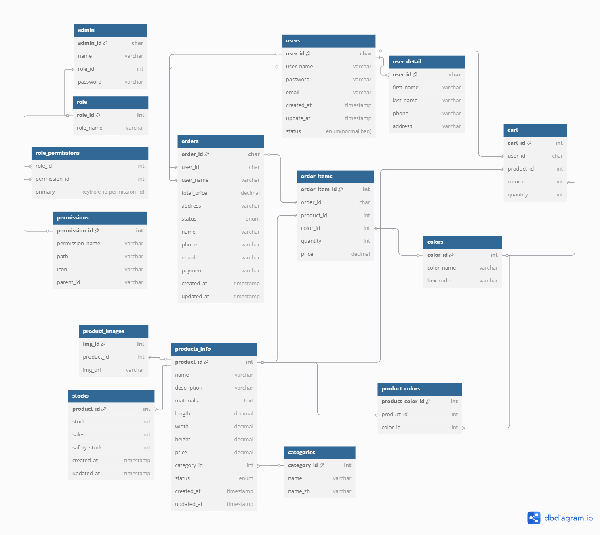

# 🛒 家家家具後台

這是一個簡易的電商後台，採用 **MVC**架構 和 **RESTful API**設計，前端使用 Vue 3 搭配 vite 以及 element plus，後端使用 Node.js + MySQL，包含 **權限控制、訂單查詢、數據視覺化** 等功能。

🛑 目前僅支援本地開發，未部屬

展示影片 : [連結](https://www.youtube.com/watch?v=hioKAC371fQ)

---

## 📊 資料庫架構

以下是本專案的 MySQL 資料庫設計：

---

## 🔹 主要功能

- **登入（Session-based ）**
- **權限控制**
- **商品管理**
- **會員 / 訂單查詢**
- **數據視覺化**

---

## 🛠️ 使用技術

- **前端**：Vue 3, vite, pinia, Element Plus, ECharts
- **後端**：Node.js, Express, MySQL, Sequelize

---
